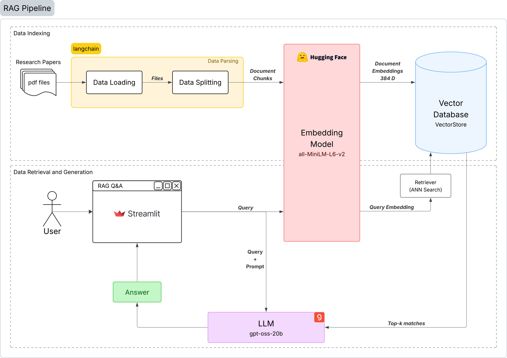

# DocQuery: Research Q&A Bot

[](https://www.python.org/)
[](https://fastapi.tiangolo.com/)
[](https://huggingface.co/transformers)
[](https://www.trychroma.com/)
[](https://groq.com/)
[](https://docs.astral.sh/uv/)

This project implements a Retrieval-Augmented Generation (RAG) pipeline for querying unstructured PDF documents (Research Papers from arXiv).

This bot will summarize the Research papers related to AI/ML in response to the user query about a Research Paper.

It combines embeddings, vector search, and a large language model to return context-aware answers in real time.

`Note`: Limited Data

## 📊 Application Workflow
<p align="center">
  
</p>

## 🚀 Features
- **Document Ingestion** (`core/data_loader.py`): Load and chunk PDF documents.
- **Embeddings** (`core/embedding_manager.py`): Generate 384-dim sentence embeddings with `all-MiniLM-L6-v2`.
- **Vector Store** (`core/vector_store.py`): Store and search embeddings using ChromaDB (HNSW indexing).
- **Retriever** (`core/retriever.py`): Fetch relevant context for queries.
- **Pipeline** (`pipelines/rag_pipeline.py`): Combine retriever + LLM (`gpt-oss-20b`) for RAG responses.
- **FastAPI Web Interface** (`app.py`): Simple and interactive interface for querying documents.
- **Configurable** (`config.py`): Centralized settings for model, database, and pipeline options.
- **Experiments** (`notebooks/rag_pipeline.ipynb`).

## ⚙️ Setup
This project uses [uv](https://docs.astral.sh/uv/) for Python package management.  
Make sure you have `uv` installed first:
```bash
pip install uv
```

Clone the repo and install dependencies:
```bash
git clone https://github.com/<your-username>/<repo-name>.git
cd <repo-name>
uv sync
```

## ▶️ Usage
**1. Build the database** (Required First Step):
Since the vector embeddings are stored locally in ChromaDB (not in the cloud), you must build the database first.
- The repository comes with a set of research papers in `data/pdf_files`.
- (Optional) Add any extra PDFs you want to query into the `data/pdf_files` directory.
- Run the build command:
```bash
python app.py --build
```
> [!IMPORTANT]
> You must run this step successfully before starting the application.

**2. API Setup**:
- Get your API key to the gemma2-9b-it model from here [groq-api-keys](https://console.groq.com/keys).
- Create a `.env` file in your project root path and assign your API key to `GROQ_API_KEY`.
  ```env
  GROQ_API_KEY=your_api_key_here
  ```

**3. Start the FastAPI app**:
Once the database is built and API key is set:
```bash
python app.py
# OR
uvicorn app:app --reload
```

Open your browser at `http://localhost:8000` to access the web interface.

Type your query about a research paper published, and get context-aware answers.

### 🧪 Test Queries
To test the system's capabilities, you can use the example queries provided in `index_evaluation/test_queries.txt`. These queries are specifically designed to test the retrieval and generation capabilities of the system against the provided research papers.

**Example Queries:**
- "What is the STAGE framework, and how does it synthesize high-fidelity execution graphs for distributed AI workloads?"
- "What is the WebText dataset, and what zero-shot task transfer capabilities did the GPT-2 model demonstrate on tasks like CoQA?"
- "What is the 'AgileThinker' agent, and how does it simultaneously engage reactive and planning paradigms?"

You can copy any query from the file and paste it into the web interface to see the results.

## 📂 Project Structure
```
.
├── core/                    # Core components
│   ├── data_loader.py       # PDF loading + chunking
│   ├── embedding_manager.py # Embedding generation
│   ├── retriever.py         # Context retrieval
│   └── vector_store.py      # ChromaDB integration
│
├── data/                    # Input and storage
│   ├── pdf_files/           # Source documents
│   └── vector_store/        # Persisted ChromaDB index
│
├── index_evaluation/              # Benchmarking
│   ├── vector_store_interface.py  # Vector store interface (ABC / Strategy)
│   ├── vector_stores.py           # Wrapers for Indexing algorithms (Concrete Strategies: ANNOY, HNSW, FAISS)
│   ├── benchmark.py               # Benchmarking logic & dataclass
│   └── evaluation.py              # Main script to run the benchmark
│
├── notebooks/
│   └── rag_pipeline.ipynb   # Experiments & benchmarks
│
├── pipelines/
│   └── rag_pipeline.py      # Full RAG pipeline logic
│
├── config.py                # Global configs
├── app.py                   # FastAPI entry point
├── pyproject.toml           # uv dependencies
├── requirements.txt         # pip fallback
├── uv.lock                  # uv lock file
├── .gitignore
└── README.md
```

## Reference
- Mengzhao Wang, Xiaoliang Xu, Qiang Yue, Yuxiang Wang. A Comprehensive Survey and Experimental Comparison of Graph-Based Approximate Nearest Neighbor Search. PVLDB, 1 (11): 1964-1978, 2021. doi:10.14778/3476249.3476255
- Ilias Azizi, Karima Echihabi, and Themis Palpanas. 2025. Graph-Based Vector Search: An Experimental Evaluation of the State-of-the-Art. Proc. ACM Manag. Data 3, 1 (SIGMOD), Article 43 (February 2025), 31 pages. https://doi.org/10.1145/3709693
- https://www.youtube.com/watch?v=fZM3oX4xEyg&list=PLZoTAELRMXVM8Pf4U67L4UuDRgV4TNX9D
- https://www.singlestore.com/blog/a-guide-to-retrieval-augmented-generation-rag/
- https://huggingface.co/sentence-transformers/all-MiniLM-L6-v2
- https://python.langchain.com/docs/introduction/
- https://console.groq.com/docs/